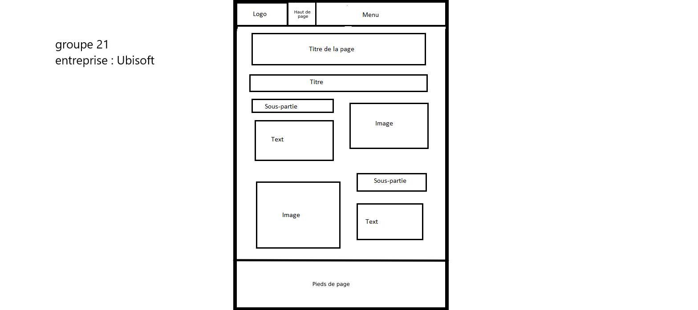
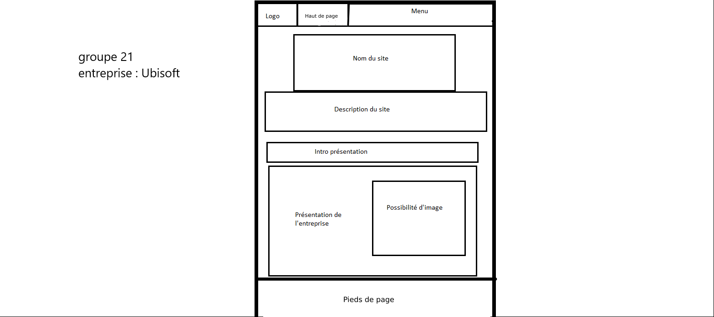
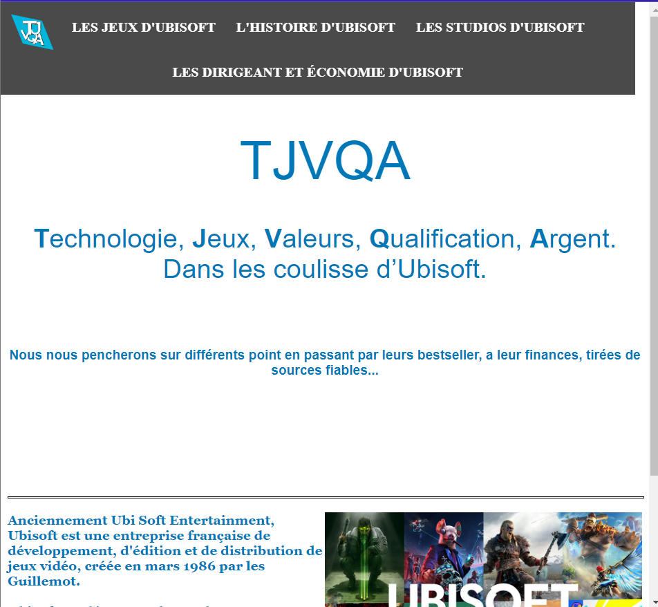
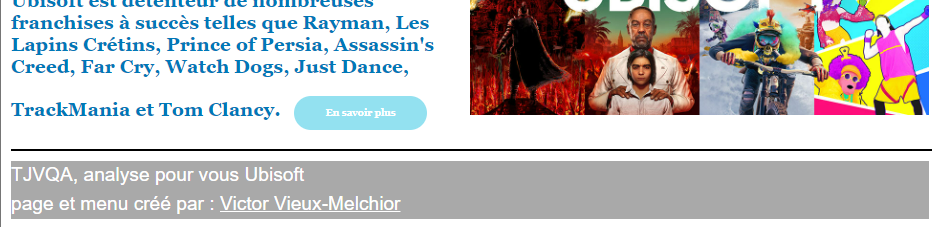

# Titre du projet : SAE S1.05-06

[Lien du site](https://tjvqa.github.io/SAE_05-06/)

Etudiant 1 (référent du groupe) :  [Théo Baumont](mailto:tbaumon2@edu.univ-fcomte.fr?subject=SAE_1_05_06) \
Etudiant 2 : [Vieux-Melchior Victor](mailto:vvieuxme@edu.univ-fcomte.fr?subject=SAE_1_05_06) \
Etudiant 3 : [Axel Joué](mailto:ajoue@edu.univ-fcomte.fr?subject=SAE_1_05_06) \
Etudiant 4 : [Quentin Sauner ](mailto:qsauner@edu.univ-fcomte.fr?subject=SAE_1_05_06) \
Etudiant 5 : [Bitar Johann](mailto:jbitar@edu.univ-fcomte.fr?subject=SAE_1_05_06)
                          

J’ai choisi de faire un zoning très basique alliant texte et image, l’inspiration me vient de différents sites tel que fandom.
La page d’accueil permet ainsi de présenter sans trop de précision l’entreprise puisque les précisions seront données dans les parties qui leurs sont attribuées.
Afin d’illustrer les propos ou tout simplement apporté de l’aération dans la page chaque image sera à coté d’un texte.
Les noms de chaque pages dans le menu du haut-de- page permet une bonne visibilité et un accès facile aux différentes pages.

## Réalisation des pages :

[Page d'accueil(index)](https://tjvqa.github.io/SAE_05-06/index.html) réalisée par Victor Vieux-Melchior

[Les jeux d'Ubisoft](https://tjvqa.github.io/SAE_05-06/Les%20Jeux%20d'Ubisoft.html) réalisée par Johann Bitar

[L'histoire d'Ubisoft](https://tjvqa.github.io/SAE_05-06/L'Histoire%20d'Ubisoft.html) réalisée par Théo Baumont

[Les Studios d'Ubisoft](https://tjvqa.github.io/SAE_05-06/Les%20studios%20d'Ubisoft.html) réalisée par Quentin Sauner

[Les Dirigeant et économie d'Ubisoft](https://tjvqa.github.io/SAE_05-06/Les%20Dirigeant%20et%20%C3%A9conomie%20d'Ubisoft.html) réalisée par Axel Joué

## Répartition des tâches :

### Théo Baumont : 
 - Envoie du sujet à M. Viezzi
 - Envoie des Membres du groupe et nom de la personne référente du groupe
 - Création de 2 écran de zoning et de 2 wireframe (menu et page)
 - Rédaction d'une partie du rapport économique
 - Création de la page : "l'histoire d'Ubisoft"
 - Recherches sur l'entreprise
 - Création d'un compte github
 - Création logo
 - Réalisations des tests de validité sur le site W3C

### Victor Vieux-Melchior : 
 - Pas de création de compte github car compte déjà existant
 - Création d'une entreprise (compte github commun)
 - Création du repositorie 
 - Création de 2 écran de zoning et de 2 wireframe (menu et page)
 - Création du prototype du site
 - Création et mise à jour du README.md
 - Création de la page d'accueil (index.html)
 - Création de la barre de navigation
 - Rédaction d'une partie du rapport économique
 - Création d’un document attestant la réalisation des tests de validité sur le site W3C 
 - Ajout de l'écran de zoning et le wireframe définitif dans le github
 - création du bouton de téléchargement du rapport économique
 - Création du groupe.txt
 - Recherches sur l'entreprise
 - Création favicon.ico
 - Réalisations des tests de validité sur le site W3C
 
### Johann Bitar :
 - Co création du Questionnaire n°1 avec Axel Joué
 - Co création du planning prévisionnel avec Quentin Sauner 
 - Rédation de 2 écran de zoning et de 2 wireframe (menu et page)
 - Co création du Questionnaire n°2 avec Axel Joué
 - Rendu du Questionnaire n°1
 - Rendu du Questionnaire n°2
 - Rédaction d'une partie du rapport économique
 - Rédaction introduction du rapport économique
 - Recherches sur l'entreprise
 - Création de la page : "les jeux d'Ubisoft"
 - Création du pied de page
 - Création d'un compte github
 - Création du slogan
 - Prise de contact avec UBISOFT
 - Création d'un google doc pour le planning
 - Réalisations des tests de validité sur le site W3C

### Quentin Sauner :
 - Co création du planning prévisionnel avec Johann Bitar
 - Création de 2 écran de zoning et de 2 wireframe (menu et page)
 - Rédaction d'une partie du rapport économique
 - Recherches sur l'entreprise
 - Création de la page : "les studios d'Ubisoft"
 - Création d'un compte github
 - Réalisations des tests de validité sur le site W3C

### Axel Joué :
 - Co création du Questionnaire n°1 avec Johann Bitar
 - Création de 2 écran de zoning et de 2 wireframe (menu et page)
 - Co création du Questionnaire n°2 avec Johann Bitar
 - Mise en page du rapport économique
 - Rédaction d'une partie du rapport économique
 - Recherches sur l'entreprise
 - Création de la page : "les dirigeants et économie d'Ubisoft"
 - Création d'un compte github
 - Réalisations des tests de validité sur le site W3C

## Réalisation écran de zoning et wireframe :
tout le monde à réalisé un écran de zoning et un wireframe
puis 2 écran de zoning (avec leur wireframe respectifs) ont été choisis par le client

[Lien vers les tests de validation du site W3C](doc/w3c.pdf)

<a href="[doc/Livrable_Économie_et_Documents_numérique/ThéoBaumont_SAES156_groupe21_UBISOFT.zip](https://github.com/TJVQA/SAE_05-06/raw/main/doc/Livrable_%C3%89conomie_et_Documents_num%C3%A9rique/Th%C3%A9oBaumont_SAES156_groupe21_UBISOFT.zip)">télécharger le rapport économique au format zip</a>