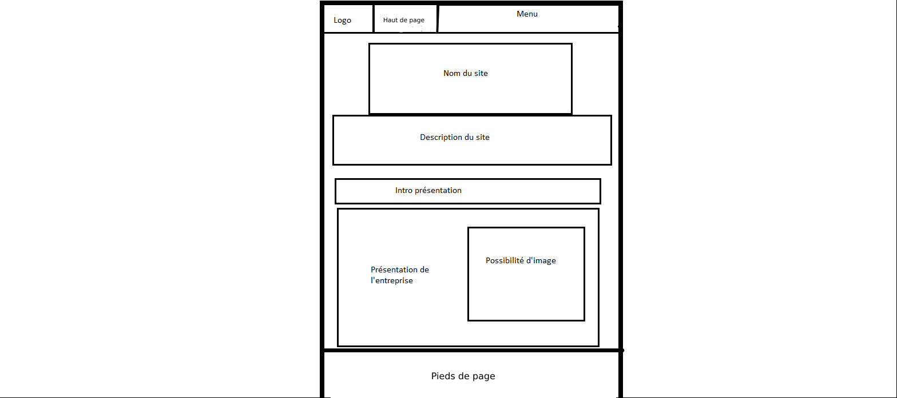
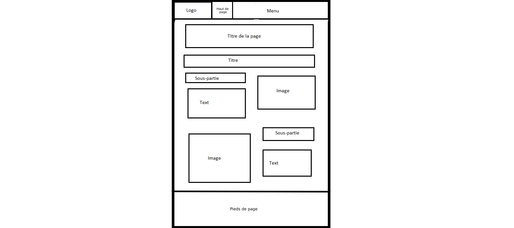
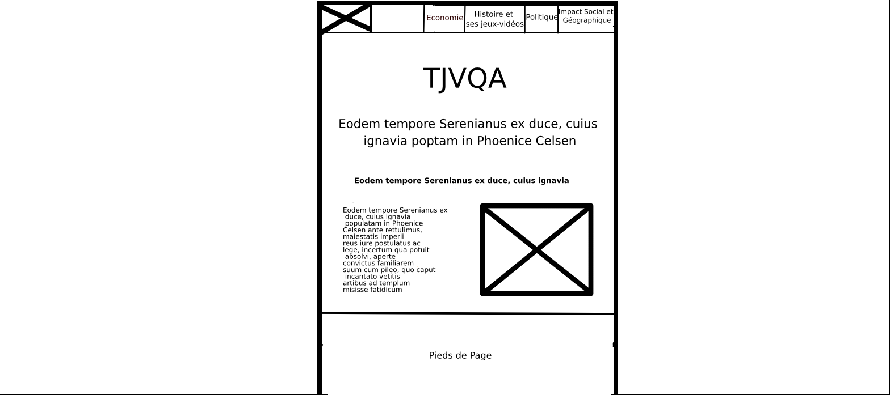
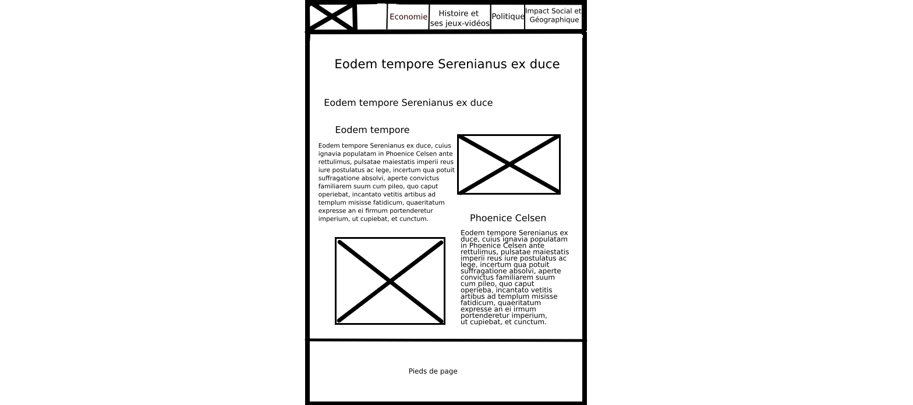

Titre du projet : SAE S1.05-06

Etudiant 1 (référent du groupe) :  [Théo Baumont](mailto:tbaumon2@edu.univ-fcomte.fr?subject=SAE_1_05_06) \
Etudiant 2 : [Vieux-Melchior Victor](mailto:vvieuxme@edu.univ-fcomte.fr?subject=SAE_1_05_06) \
Etudiant 3 : [Axel Joué](mailto:ajoue@edu.univ-fcomte.fr?subject=SAE_1_05_06) \
Etudiant 4 : [Quentin Sauner ](mailto:qsauner@edu.univ-fcomte.fr?subject=SAE_1_05_06) \
Etudiant 5 : [Bitar Johann](mailto:jbitar@edu.univ-fcomte.fr?subject=SAE_1_05_06)
                          

